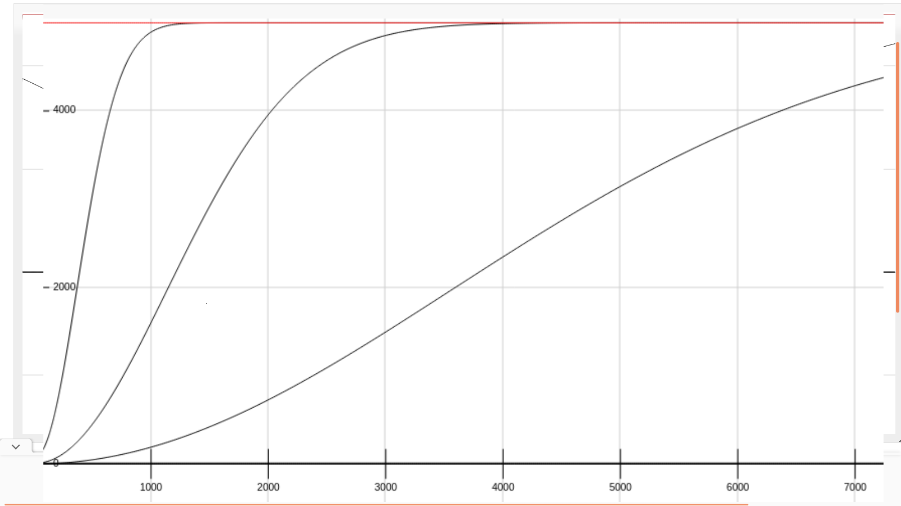

# Stakan

## Overview

A simple old funny arcade puzzle game that demonstrates usage 
of Solana contracts combined with Arweave persistance.


## Website  
    https://retamogordo.github.io/stakan/

## Disclaimer

This product was designed for exclusively demonstration purpose,
it leverages Solana Devnet for transactions, which means no real assets
are involved.  
Similar reasoning applies to Arweave transactions which are executed on a local node only.  

## Function

The simplest and least interesting mode to play is for free. You just press the Free Play button and play, nothing more happens.  
If you want to stake you'll need to properly set up your wallet adapters and sign up by entering a username so your name appears on the glory board when you hit all the record scores.  

## Setup procedure

### Solana
I tested the code with Solflare and Phantom wallet adapters on Firefox and Chromium browsers.   
First you'll need to set your wallet adapters network to Devnet.  


Next you'll need to airdrop some lamports onto your wallet. This can be done, for instance, by using solana-cli.  
Please refer to https://docs.solana.com/cli/install-solana-cli-tools for installation instructions.  
Once installed, open a terminal and configure it by:  

```solana config set --url devnet```  

Then airdrop some sol:  

```solana airdrop 2 <your wallet pubkey>```  

### Arweave
Please install ArConnect browser extention.   
You will need to set up an Arweave Wallet by a standard procedure involving seedphrase feeding.  
On ArConnect from Settings->Gateway->Custom choose your gateway to be 
localhost, port 1984, protocol http.  
In a terminal window run Arweave local server by:

```npx arlocal```  

This should run on its default port 1984.  


## Staking
Stakan contract maintains an account which holds the winner reward fund of Stakan Tokens.   
This account was initialized once soon after contract deployment.   
When initialized the initial token supply was minted. Besides, the account holds another global data, like maximum score ever and champions account public key.  
The upper bound of reward is calculated by simple exponential backoff and is limited to half of the current token supply on the global account.  
The lower bound equals to amount of tokens on stake.  
The exact formula for reward calculation is explained futher.  

## Before you start
Observe the left panel.   
Basically, if you see red things there, something is not set up or went wrong.  
If you see you are logged in, this means the contract is accessed on Solana Devnet.  
If the arlocal is running you'll need to press Airdrop Winston button so your game session can be stored on Arweave when finished.   
Also you'll need to purchase Stakan Token(s) in order to be able to stake.  
If you see all those green checks beneath 'Connection and Balance Status' you can enter the amount of tokens to stake by the Stake & Start button to unlock it.


When you hit the Stake&Start button your Solana wallet will ask your to confirm the transaction.   
At this point the stake is not charged yet, it will be charged only when the game session is over and only if you don't hit the record score.  
The transaction the wallet asks you to confirm is for creating a temporary account for the game session.   
Once the session is over its account will be closed and your lamports are back into your wallet (the wallet asks to confirm this too).  
This temporary account exists for the case of connection outage or other forced circumstances, when your session is interrupted.   
Also it will prevent you from cheating by dropping the session when you feel you're not doing it.  
See below for how you can really cheat the contract.  
As interrupted session is stored on browsers local storage it will be resumed next time you want to play.  
When the game session is over your stake goes to the reward fund in the case you lose, otherwise you're rewarded for victory.  
No matter the result, your session is stored on Arweave local node and this fact is reflected on the left panel on the bottom.  
The sessions are there as long as arlocal server runs.  

## Chain Polling
The Solana Devnet is polled regularly to query current game session accounts on-chain in order to display usernames of gamers owning these sessions.  
The players usernames are displayed as Active Users on the right panel.  

## Contract Description
### Global Accounts
After program deployment, the global account setup routine is run. It creates a PDA wallet for lamports (I called this account escrow, which is not an accurate name) held for tokens being trade.    
The initial amount of lamports on it fits the number of initial token supply.  
These tokens are kept in a reward account.
The two mentioned accounts are established once and their balances are modified during token trading and reward distribution.

### User Account
When a new user signs up two accounts are created:  
the first one references user wallet pubkey and token account (this is the second account created upon signing up), arweave storage id, user name, number of game session ever played and so on.  
The second account created is an associated token account for holding Stakan tokens being traded and staked.  
The user can sign out if they don't have a game session pending.  
In this case their tokens are sold, so the user gets the corresponding amount of lamports back to their wallet.  

### Token Trading
When a user purchases tokens, the desired token supply is minted out of thin air and deposited to their associated token account.  
To compensate the token supply, corresponding amount of lamports is transfered from users wallet to programs global PDA wallet (escrow).
Thus the total token supply grows as well as overall lamport amount involved in the contract.  
When the user sells their tokens, these are transfered to the global reward account and the user gets the corresponding amount of lamports onto their wallet from the global PDA wallet.

### Game Session
When the user initiates a game session, a new account is created. It holds the token stake amount and serves as a lock for ongoing session.  
This prevents the user from starting multiple sessions at one time and ensures that the stake is not lost if the client gets disconnected.    
The account is closed after the session is over and stored to Arweave node. 

## Tests
There are some tests that can be run on Solana localnet test validator.  
In the cloned repo modify Anchor.toml cluster to 'localnet'.  
Build the library by running   
``` anchor build ```  
then  
``` anchor run after-build ```  
run the local validator in a terminal window  
``` solana-test-validator ```  
and  
``` anchor deploy ```  
There is no need to run arweave node since it is run by the test itself.  

## Reward Calculation
The formula was found empirically, basically it sets lower and upper bounds for the reward, which asympthotically reaches total_reward_amount/2 at infinity while the curve slope depends on stake and score record values.

reward upper limit: h = total_reward_amount/2  
reward lower limit: s = user_stake  
max. score record: x0  
users score: x  
user reward: y  

formula:   
    if x <= x0 then ```y = -s``` => user loses, stake is taken    
    else ```y = h + (s-h)*exp(-s/h*x*(x-x0)/h)```

Some sketches of these functions family:  



## Cheating
The web client communicates directly to the Solana program, so anybody can modify the client in such a way it sends counterfeit score to the program thus gaining the reward.

## Contributions
This project is experimental.  
Solana contract review, design flaws, bug reports, better client UI or any other suggestions are welcome with gratitude.  


## Acknowledgements
These resourses have been highly useful for me during the process of development:  
    - https://lorisleiva.com/create-a-solana-dapp-from-scratch  
    - https://github.com/paul-schaaf/solana-escrow/  
    - David Choi Solana Programming series on Youtube:   
        https://www.youtube.com/c/DavidChoiProgrammer  
    - Solana Cookbook  
    - http://fooplot.com