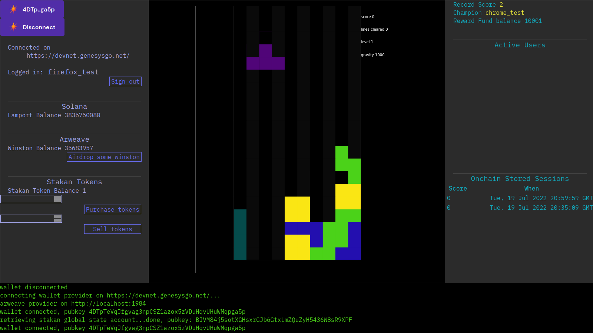
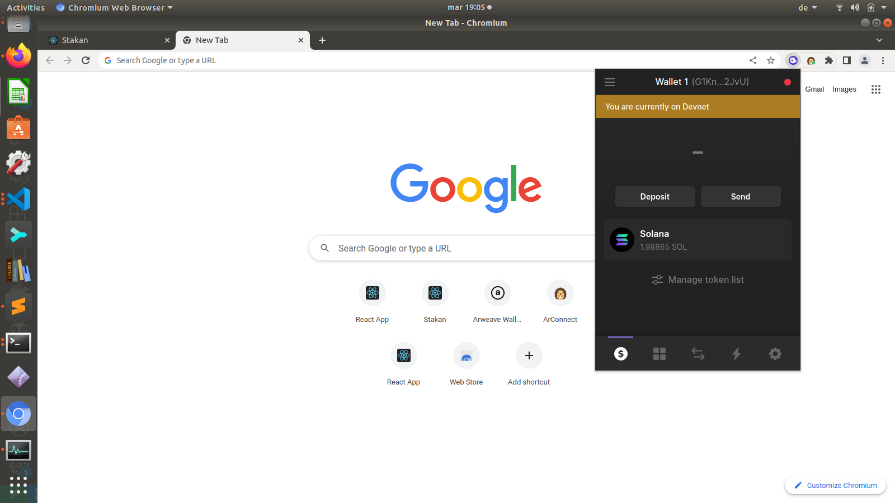
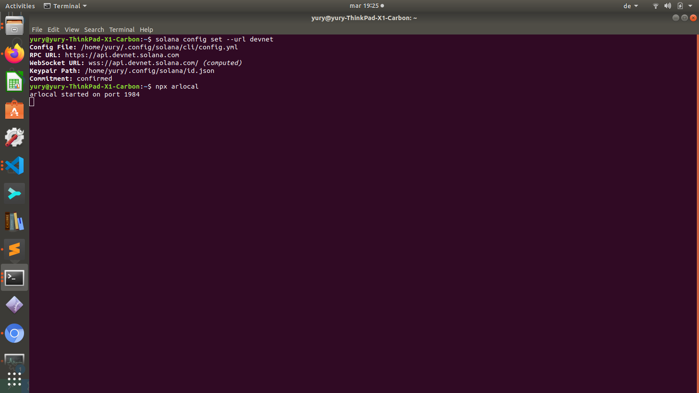
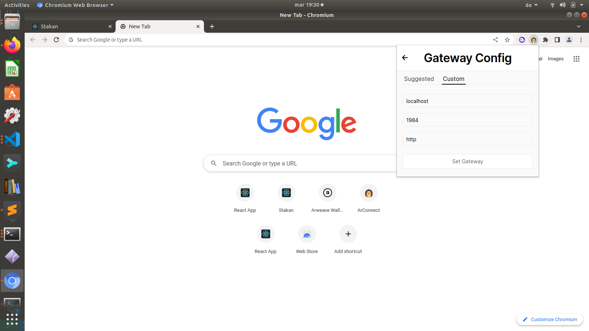
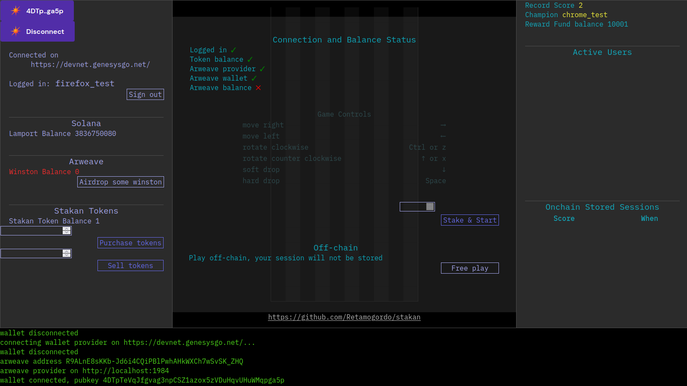

# Stakan

## Overview

A simple old funny arcade puzzle game that demonstrates usage 
of Solana contracts combined with Arweave persistance.



## Disclaimer

This product was designed for exclusively demonstration purpose,
it leverages Solana Devnet for transactions, which means no real assets
are involved.  
The same reasoning applies to Arweave transactions which are executed on a local node only.  

## Function

The simplest and least interesting mode to play is for free. You just press the Free Play button and play, nothing more happens.  
If you want to stake you'll need to properly set up your wallet adapters and sign up by entering a username so your name appears on the glory board when you hit all the record scores.  

## Setup procedure

### Solana
I tested the code with Solflare and Phantom wallet adapters on Firefox and Chromium browsers.   
First you'll need to set your wallet adapters network to Devnet.  



Next you'll need to airdrop some lamports onto your wallet. This can be done, for instance, by using solana-cli.  
Please refer to https://docs.solana.com/cli/install-solana-cli-tools for installation instructions.  
Once installed, open a terminal and configure it by:  

solana config set --url devnet  

Then airdrop some sol:  

```solana airdrop 2 <your wallet pubkey>  

### Arweave
Please install ArConnect browser extention.   
You will need to set up an Arweave Wallet by a standard procedure involving seedphrase feeding.  
On ArConnect from Settings->Gateway->Custom choose your gateway to be 
localhost, port 1984, protocol http.  
In a terminal window run Arweave local server by:

npx arlocal  

This should run on its default port 1984.  




## Staking
Stakan contract maintains an account which holds the winner reward fund of Stakan Tokens.   
This account was initialized once soon after contract deployment.   
When initialized the initial token supply was minted. Besides, the account holds another global data, like maximum score ever and champions account public key.  
The upper bound of reward is calculated by simple exponential backoff and is limited to half of the current token supply on the global account.  
The lower bound equals to amount of tokens on stake.  
The exact formula for reward calculation is explained futher.  

## Before you start
Observe the left panel.   
Basically, if you see red things there, something is not set up or went wrong.  
If you see you are logged in, this means the contract is accessed on Solana Devnet.  
If the arlocal is running you'll need to press Airdrop Winston button so your game session can be stored on Arweave when finished.   
Also you'll need to purchase Stakan Token(s) in order to be able to stake.  
If you see all those green checks beneath 'Connection and Balance Status' you can enter the amount of tokens to stake by the Stake & Start button to unlock it.



When you hit the Stake&Start button your Solana wallet will ask your to confirm the transaction.   
At this point the stake is not charged yet, it will be charged only when the game session is over and only if you don't hit the record score.  
The transaction the wallet asks you to confirm is for creating a temporary account for the game session.   
Once the session is over its account will be closed and your lamports are back into your wallet (the wallet asks to confirm this too).  
This temporary account exists for the case of connection outage or other forced circumstances, when your session is interrupted.   
Also it will prevent you from cheating by dropping the session when you feel you're not doing it.  
See below for how you can really cheat the contract.  
As interrupted session is stored on browsers local storage it will be resumed next time you want to play.  
When the game session is over your stake goes to the reward fund in the case you lose, otherwise you're rewarded for victory.  
No matter the result, your session is stored on Arweave local node and this fact is reflected on the left panel on the bottom.  
The sessions are there as long as arlocal server runs.  

## Cheating
The web client communicates directly to the Solana program, so anybody can modify the client in such a way it sends counterfeit score to the program thus gaining the reward.

## Acknowledgements
These resourses have been highly useful for me during the process of development:  
    - https://lorisleiva.com/create-a-solana-dapp-from-scratch  
    - https://github.com/paul-schaaf/solana-escrow/  
    - David Choi Solana Programming series on Youtube:   
        https://www.youtube.com/c/DavidChoiProgrammer  
    - Solana Cookbook